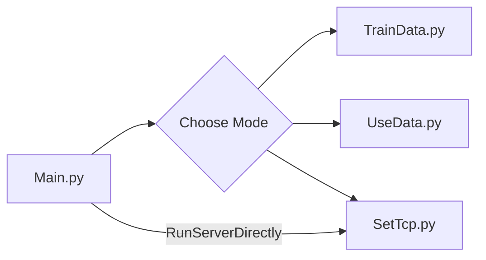
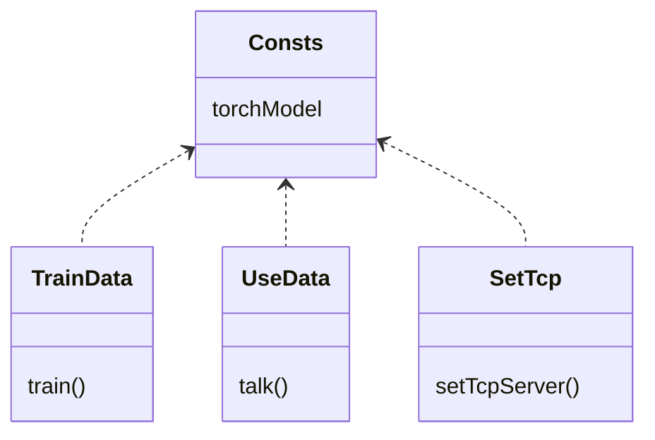

# ARKO_Docker

[]()[]()[]()


## About The Project

팀 프로젝트 "인공지능이 들려주는 시각예술이야기"에 사용될 인공지능 챗봇 서버를 위한 도커파일 입니다. SKT-AI에서 제공하는 KoGPT2를 활용하여 대화, 훈련이 가능하도록 인터페이스를 만들었고. 포트가 세팅된 상태에서 원시적인 형태의 서버로도 활용가능하도록 준비되어 있습니다.


## Built With

- [](https://www.python.org/downloads/release/python-381/)
- [](https://github.com/SKT-AI/KoGPT2#kogpt2-%ED%95%9C%EA%B5%AD%EC%96%B4-gpt-2-ver-20)

- [](https://www.python.org/downloads/release/python-381/)

- [](https://www.python.org/downloads/release/python-381/)

  

## Getting Started 

```bash
docker pull projecta2022/chatbot-server
docker run -it -p 1280:1280 projecta2022/chatbot-server:latest
```

or

```bash
git clone https://github.com/BaekNothing/ARKO_Docker.git ./ARKO_Docker
cd ARKO_Docker
pip install --upgrade pip
pip install --trusted-host pypi.python.org -r requirements.txt
python Main.py
```

** Git에서 Clone하는 경우** 다음의 폴더/파일을 추가할 것 

> stable/
>
> |-- data/ChaBotData.csv, 
>
> |--kogpt2-base-v2/
>
> |--models/model.bin


## Flow Chart




### Class Structure




## Contributing

이 프로젝트는 버그리포트, 제안, 이슈 등 모든 형태의 기여를 환영합니다. 🤣

The project welcomes all forms of contribution, including bug reports, suggestions, and issues.
